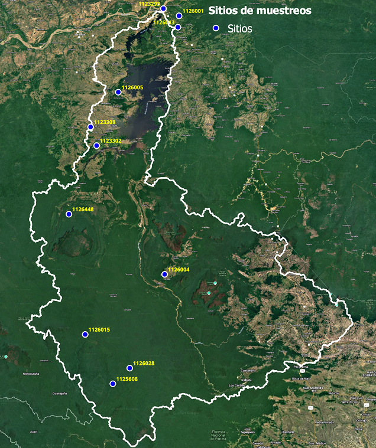

# BASE DE DATOS {-}

Esta seccion muestra la base de información consultada sobre suelos de la cuenca del rio Caroni, y reune capas tanto del tipo raster (tiff) como vectoriales (shapefile) proyectadas cartograficamente en el sistema de coordenadas Universal Transversal Mercator (UTM), zona 20 del hemisferio norte, datum SIRGAS-REGVEN.

Se desarrolló como una interfaz para facilitar la descarga de la geoinformación almacenada y organizada dentro de un repositorio en linea github. Ademas se muestra separada por variable o propiedades de los suelos y por fuente consultada.

---

## Clase de suelos {-}

Comprende las capas de clases taxonomicas de los suelos encontradas en diferentes fuentes y estudios como los del **Plan Maestro**, las bases de datos de **Soilgrids** y **FAO**. A continuacion se muestran cada una de ellas.

### Plan Maestro de la cuenca del rio Caroni EDELCA {-}

Este estudio se realizo entre los años 1999 y  2003 por EDELCA en colaboracion con PDVSA Palmaven, Tecnocolsul e Integral. Como base se tomaron diferentes estudios donde resaltan los realizados por Tecnica Minera C.A. (Tecmin).

De este estudio publicado en 2004 se obtuvieron los mapas de suelos de la cuenca y subcuencas (sectores) del río Caroní, a una escala de 1:250.000 y 1:500.000.

La informacion de suelos esta expresada en dos distintas extensiones y escalas, una a cuenca completa con escala 1:500.000 y la otra separada por subcuenca a escala 1:250.000. El sistema de clasificacion empleados es el Soils Taxonomy y muestra unidades cartograficas de suelos en un nivel categorico de fases de grandes grupos. La figura a continuacion muestra las clases de los suelos de la cuenca.

###### Enlaces para descarga {-}
 

 
|Descripcion|Nombre archivo|
|:----|:---:|
|Unidades de suelos Cuenca completa - 1:500.000||
|Unidades de suelos Bajo Caroni - 1:250.000|[Csuebcpm](BDsuelos_Caroni\3_Geoinformacion\Vectorial\1_Plan_Maestro_2004/Csuebcpm.zip)|
|Unidades de suelos Medio Caroni - 1:250.000|[Csuemcpm](BDsuelos_Caroni\3_Geoinformacion\Vectorial\1_Plan_Maestro_2004/Csuemcpm.zip)|
|Unidades de suelos Alto Caroni Este - 1:250.000|[Csueacepm](BDsuelos_Caroni\3_Geoinformacion\Vectorial\1_Plan_Maestro_2004/Csueacepm.zip)|
|Unidades de suelos Alto Caroni Oeste - 1:250.000|[Csueacopm](BDsuelos_Caroni\3_Geoinformacion\Vectorial\1_Plan_Maestro_2004/Csueacopm.zip)|
|Unidades de suelos Alto Paragua - 1:250.000|[Csueappm](BDsuelos_Caroni\3_Geoinformacion\Vectorial\1_Plan_Maestro_2004/Csueappm.zip)|
|Unidades de suelos Bajo Paragua - 1:250.000|[Csuebppm](BDsuelos_Caroni\3_Geoinformacion\Vectorial\1_Plan_Maestro_2004/Csuebppm.zip)|

### Soilgrids {-}

SoilGrids es un sistema de mapeo digital global del suelo que utiliza machine learning para modelar la distribución espacial de las propiedades del suelo en el mundo. Las capas de inforaicon son del tipo raster y su resolucion espacial es de 250 m.

De este estudio disponible en la web (https://soilgrids.org/) se obtuvieron diferentes variables de suelos, dentro de las cuales destacan las propiedades físicas y químicas: densidad aparente; porcentaje de arena, limo y arcilla; fragmento grueso, capacidad de intercambio catiónico, carbono orgánico de los suelos, su almacenaje y densidad, pH, nitrógeno, contenido volumétrico de agua en los suelos (capacidad de campo y punto de marchitez permanente). También se obtuvieron las Clases de Suelos según la Base Referencial  Mundial del Recurso Suelo (WRB) y once perfiles de suelos, con sus respectivos horizontes. A continuación se muestran algunas imágenes del estudio y posteriormente los enlaces de descarga de esta información.

###### Enlaces para descarga {-}
 

 
|Descripcion|Nombre archivo|
|:------|:---:|
|Base de referencia mundial (2006) Grupos de suelos - Resolucion 250 m|[Csuewrbsg](BDsuelos_Caroni\3_Geoinformacion\Raster\2_Soilgrids/Csuewrbsg.zip)|

### Base de datos de suelos armonizados de FAO {-}

La Base de Datos armonizada de Los Suelos del Mundo consiste en una base de celdas de 30 arcosegundos incluyendo más de 15.000 unidades cartográficas de suelo a lo que armoniza actualizaciones regionales y nacionales de información de suelos del mundo (SOTER, ESD, Mapa de Suelos de China, WISE) con la información contenida entre la escala de 1:500.000 del Mapa Mundial de Suelos de la FAO-UNESCO (FAO, 1971-1981). 

Se extrajo el area de la cuenca, se proyecto al sistema pertinente y convirtio a vector para enlazar  las propiedades del suelo en su tabla atributiva. 

###### Enlaces para descarga {-}
 

 
|Descripcion|Escala/resolucion|Nombre archivo|
|:----|:---:|:---:|
|Base de referencia mundial (2006) Grupos de suelos|250 m|[Csuebdhfao](BDsuelos_Caroni\3_Geoinformacion\Vectorial\3_Fao_Harmonized/Csuebdhfao2.zip)|

---

## Capacidad de uso de las tierras {-}

Capa sobre la Capacidad de Uso de las tierras en la cuenca para dos alcance y escalas, una a cuenca completa a escala 1:500.000 y otras por subcuencas en una escala de 1:250.000. Originarias del estudio **Plan Maestro de la Cuenca**.  

###### Enlaces para descarga {-}
 

 
|Descripcion|Nombre archivo|
|:----|:---:|
|Capacidad de uso de las tierras Cuenca completa - 1:500.000||
|Capacidad de uso de las tierras Bajo Caroni - 1:250.000|[Cusobcpm](BDsuelos_Caroni\3_Geoinformacion\Vectorial\1_Plan_Maestro_2004/Cusobcpm.zip)|
|Capacidad de uso de las tierras Medio Caroni - 1:250.000|[Cusomcpm](BDsuelos_Caroni\3_Geoinformacion\Vectorial\1_Plan_Maestro_2004/Cusomcpm.zip)|
|Capacidad de uso de las tierras Alto Caroni Este - 1:250.000|[Cusoacepm](BDsuelos_Caroni\3_Geoinformacion\Vectorial\1_Plan_Maestro_2004/Cusoacepm.zip)|
|Capacidad de uso de las tierras Alto Caroni Oeste - 1:250.000|[Cusoacopm](BDsuelos_Caroni\3_Geoinformacion\Vectorial\1_Plan_Maestro_2004/Cusoacopm.zip)|
|Capacidad de uso de las tierras Alto Paragua - 1:250.000|[Cusoappm](BDsuelos_Caroni\3_Geoinformacion\Vectorial\1_Plan_Maestro_2004/Cusoappm.zip)|
|Capacidad de uso de las tierras Bajo Paragua - 1:250.000|[Cusobppm](BDsuelos_Caroni\3_Geoinformacion\Vectorial\1_Plan_Maestro_2004/Cusobppm.zip)|

---

## Riesgo de erosion potencial {-}

Capa sobre el Riesgo de erosion potencial de las tierras, basado en la metodologia de la USLE, para dos alcance y escalas, una a cuenca completa a escala 1:500.000 y otras por subcuencas en una escala de 1:250.000. Originarias del estudio **Plan Maestro de la Cuenca**.  

###### Enlaces para descarga {-}
 

 
|Descripcion|Nombre archivo|
|:----|:---:|
|Riesgo de erosion de los suelos Cuenca completa - 1:500.000||
|Riesgo de erosion de los suelos Bajo Caroni - 1:250.000|[Repbcpm](BDsuelos_Caroni\3_Geoinformacion\Vectorial\1_Plan_Maestro_2004/Repbcpm.zip)|
|Riesgo de erosion de los suelos Medio Caroni - 1:250.000|[Repmcpm](BDsuelos_Caroni\3_Geoinformacion\Vectorial\1_Plan_Maestro_2004/Repmcpm.zip)|
|Riesgo de erosion de los suelos Alto Caroni Este - 1:250.000|[Repacepm](BDsuelos_Caroni\3_Geoinformacion\Vectorial\1_Plan_Maestro_2004/Repacepm.zip)|
|Riesgo de erosion de los suelos Alto Caroni Oeste - 1:250.000|[Repacopm](BDsuelos_Caroni\3_Geoinformacion\Vectorial\1_Plan_Maestro_2004/Repacopm.zip)|
|Riesgo de erosion de los suelos Alto Paragua - 1:250.000|[Repappm](BDsuelos_Caroni\3_Geoinformacion\Vectorial\1_Plan_Maestro_2004/Repappm.zip)|
|Riesgo de erosion de los suelos Bajo Paragua - 1:250.000|[Repbppm](BDsuelos_Caroni\3_Geoinformacion\Vectorial\1_Plan_Maestro_2004/Repbppm.zip)|

---

## Arena {-}

Contenido de arena en g/kg para toda la cuenca en una capa de tipo raster con una resolucion espacial de 250 m originaria de la base de datos **Soilgrids**.

###### Enlaces para descarga {-}
 

 
|Descripcion|Nombre archivo|
|:----|:---:|
|Arena (g/kg) 0 a 5 cm - resolucion 250s m|[Are05sg](BDsuelos_Caroni\3_Geoinformacion\Raster\2_Soilgrids/Are05sg.zip)|
|Arena (g/kg) 5 a 15 cm - resolucion 250 m|[Are515sg](BDsuelos_Caroni\3_Geoinformacion\Raster\2_Soilgrids/Are515sg.zip)|
|Arena (g/kg) 15 a 30 cm - resolucion 250 m|[Are1530sg](BDsuelos_Caroni\3_Geoinformacion\Raster\2_Soilgrids/Are1530sg.zip)|

---

## Limo {-}

Contenido de limo en g/kg para toda la cuenca en una capa de tipo raster con una resolucion espacial de 250 m originaria de la base de datos **Soilgrids**.

###### Enlaces para descarga {-}
 

 
|Descripcion|Nombre archivo|
|:----|:---:|
|Limo (g/kg) 0 a 5 cm - resolucion 250 m|[Lim05sg](BDsuelos_Caroni\3_Geoinformacion\Raster\2_Soilgrids/Lim05sg.zip)|
|Limo (g/kg) 5 a 15 cm - resolucion 250 m|[Lim515sg](BDsuelos_Caroni\3_Geoinformacion\Raster\2_Soilgrids/Lim515sg.zip)|
|Limo (g/kg) 15 a 30 cm - resolucion 250 m|[Lim1530sg](BDsuelos_Caroni\3_Geoinformacion\Raster\2_Soilgrids/Lim1530sg.zip)|

---

## Arcilla {-}

Contenido de arcilla en g/kg para toda la cuenca en una capa de tipo raster con una resolucion espacial de 250 m originaria de la base de datos **Soilgrids**.

###### Enlaces para descarga {-}
 

 
|Descripcion|Nombre archivo|
|:----|:---:|
|Arcilla (g/kg) 0 a 5 cm - resolucion 250 m|[Arc05sg](BDsuelos_Caroni\3_Geoinformacion\Raster\2_Soilgrids/Arc05sg.zip)|
|Arcilla (g/kg) 5 a 15 cm - resolucion 250 m|[Arc515sg](BDsuelos_Caroni\3_Geoinformacion\Raster\2_Soilgrids/Arc515sg.zip)|
|Arcilla (g/kg) 15 a 30 cm - resolucion 250 m|[Arc1530sg](BDsuelos_Caroni\3_Geoinformacion\Raster\2_Soilgrids/Arc1530sg.zip)|

---

## Fragmento grueso {-}

Contenido de fragmento grueso en cm3/dm3 para toda la cuenca en una capa de tipo raster con una resolucion espacial de 250 m originaria de la base de datos **Soilgrids**.

###### Enlaces para descarga {-}
 

 
|Descripcion|Nombre archivo|
|:----|:---:|
|Fragmento grueso (cm3/dm3) 0 a 5 cm - resolucion 250 m|[Fra05sg](BDsuelos_Caroni\3_Geoinformacion\Raster\2_Soilgrids/Fra05sg.zip)|
|Fragmento grueso (cm3/dm3) 5 a 15 cm - resolucion 250 m|[Fra515sg](BDsuelos_Caroni\3_Geoinformacion\Raster\2_Soilgrids/Fra515sg.zip)|
|Fragmento grueso (cm3/dm3) 15 a 30 cm - resolucion 250 m|[Fra1530sg](BDsuelos_Caroni\3_Geoinformacion\Raster\2_Soilgrids/Fra1530sg.zip)|

---

## Densidad aparente {-}

Densidad aparente den cg/cm3 de los suelos para toda la cuenca en una capa de tipo raster con una resolucion espacial de 250 m originaria de la base de datos **Soilgrids**.

###### Enlaces para descarga {-}
 

 
|Descripcion|Nombre archivo|
|:----|:---:|
|Densidad aparente (cg/cm3) 0 a 5 cm - resolucion 250 m|[Dap05sg](BDsuelos_Caroni\3_Geoinformacion\Raster\2_Soilgrids/Dap05sg.zip)|
|Densidad aparente  (cg/cm3) 5 a 15 cm - resolucion 250 m|[Dap515sg](BDsuelos_Caroni\3_Geoinformacion\Raster\2_Soilgrids/Dap515sg.zip)|
|Densidad aparente  (cg/cm3) 15 a 30 cm - resolucion 250 m|[Dap1530sg](BDsuelos_Caroni\3_Geoinformacion\Raster\2_Soilgrids/Dap1530sg.zip)|

---

## Contenido volumetrico de agua a CC {-}

Contenido vlumetrico de agua en el suelos (Capacidad de Campo) para toda la cuenca en una capa de tipo raster con una resolucion espacial de 250 m, originaria de la base de datos **Soilgrids**.

###### Enlaces para descarga {-}
 

 
|Descripcion|Nombre archivo|
|:----|:---:|
|Capacidad de campo 0 a 5 cm - resolucion 250 m|[Cva3305sg](BDsuelos_Caroni\3_Geoinformacion\Raster\2_Soilgrids/Cva3305sg.zip)|
|Capacidad de campo 5 a 15 cm - resolucion 250 m|[Cva33515sg](BDsuelos_Caroni\3_Geoinformacion\Raster\2_Soilgrids/Cva33515sg.zip)|
|Capacidad de campo 15 a 30 cm - resolucion 250 m|[Cva331530sg](BDsuelos_Caroni\3_Geoinformacion\Raster\2_Soilgrids/Cva331530sg.zip)|

---

## Contenido volumetrico de agua a PMP {-}

Contenido vlumetrico de agua en el suelos (Punto de Marchitez Permanente) para toda la cuenca en una capa de tipo raster con una resolucion espacial de 250 m, originaria de la base de datos **Soilgrids**.

###### Enlaces para descarga {-}
 

 
|Descripcion|Nombre archivo|
|:----|:---:|
|Punto de marchitez permanente 0 a 5 cm - resolucion 250 m|[Cva150005sg](BDsuelos_Caroni\3_Geoinformacion\Raster\2_Soilgrids/Cva150005sg.zip)|
|Punto de marchitez permanente 5 a 15 cm - resolucion 250 m|[Cva1500515sg](BDsuelos_Caroni\3_Geoinformacion\Raster\2_Soilgrids/Cva1500515sg.zip)|
|Punto de marchitez permanente 15 a 30 cm - resolucion 250 m|[Cva15001530sg](BDsuelos_Caroni\3_Geoinformacion\Raster\2_Soilgrids/Cva15001530sg.zip)|

---

## pH {-}

### Soilgrids {-}

Capa de pH de los suelos en (pH * 10) para toda la cuenca en una capa de tipo raster con una resolucion espacial de 250 m originaria de la base de datos **Soilgrids**.

###### Enlaces para descarga {-}
 

 
|Descripcion|Nombre archivo|
|:----|:---:|
|pH (pH * 10) 0 a 5 cm - resolucion 250 m|[Ph05sg](BDsuelos_Caroni\3_Geoinformacion\Raster\2_Soilgrids/Ph05sg.zip)|
|pH (pH * 10) 5 a 15 cm - resolucion 250 m|[Ph515sg](BDsuelos_Caroni\3_Geoinformacion\Raster\2_Soilgrids/Ph515sg.zip)|
|pH (pH * 10) 15 a 30 cm - resolucion 250 m|[Ph1530sg](BDsuelos_Caroni\3_Geoinformacion\Raster\2_Soilgrids/Ph1530sg.zip)|

### Sevilla - FAO {-}

Capa de pH de los suelos para toda la cuenca en una capa de tipo raster con una resolucion espacial de 950 m, desarrollada para dos capas superficiales de suelos ( 0 a 30 cm y 30 a 100 cm) por **Victor Sevilla y FAO**.

###### Enlaces para descarga {-}
 

 
|Descripcion|Nombre archivo|
|:----|:---:|
|pH 0 a 30 cm - resolucion 90 m|[Ph030vsfao](BDsuelos_Caroni\3_Geoinformacion\Raster\3_Sevilla_FAO/Ph030vsfao.zip)|
|pH 30 a 100 cm - resolucion 90 m|[Ph30100vsfao](BDsuelos_Caroni\3_Geoinformacion\Raster\3_Sevilla_FAO/Ph30100vsfao.zip)|

---

## Carbono organico {-}

### Soilgrids {-}

Contenido de carbono organico en el suelos para toda la cuenca en una capa de tipo raster con una resolucion espacial de 250 m, originaria de la base de datos **Soilgrids**.

###### Enlaces para descarga {-}
 

 
|Descripcion|Nombre archivo|
|:----|:---:|
|Carbono organico (dg/kg) 0 a 5 cm - resolucion 250 m|[Cos05sg](BDsuelos_Caroni\3_Geoinformacion\Raster\2_Soilgrids/Cos05sg.zip)|
|Carbono organico (dg/kg) 5 a 15 cm - resolucion 250 m|[Cos515sg](BDsuelos_Caroni\3_Geoinformacion\Raster\2_Soilgrids/Cos515sg.zip)|
|Carbono organico (dg/kg) 15 a 30 cm - resolucion 250 m|[Cos1530sg](BDsuelos_Caroni\3_Geoinformacion\Raster\2_Soilgrids/Cos1530sg.zip)|

### Sevilla - FAO {-}

Contenido de carbono organico en g/Kg para toda la cuenca en una capa de tipo raster con una resolucion espacial de 90 m, desarrollada para dos capas superficiales de suelos ( 0 a 30 cm y 30 a 100 cm) por **Victor Sevilla y FAO**.

###### Enlaces para descarga {-}
 

 
|Descripcion|Nombre archivo|
|:----|:---:|
|Carbono organico (g/kg) 0 a 5 cm - resolucion 90 m|[Cos05vsfao](BDsuelos_Caroni\3_Geoinformacion\Raster\3_Sevilla_FAO/Cos05vsfao.zip)|
|Carbono organico (g/kg) 5 a 15 cm - resolucion 90 m|[Cos515vsfao](BDsuelos_Caroni\3_Geoinformacion\Raster\3_Sevilla_FAO/Cos515vsfao.zip)|
|Carbono organico (g/kg) 15 a 30 cm - resolucion 90 m|[Cos1530vsfao](BDsuelos_Caroni\3_Geoinformacion\Raster\3_Sevilla_FAO/Cos1530vsfao.zip)|

---

## Densidad de Carbono organico {-}

Densidad de carbono organico en hg/m3 para toda la cuenca en una capa de tipo raster con una resolucion espacial de 250 m, originaria de la base de datos **Soilgrids**.

###### Enlaces para descarga {-}
 

 
|Descripcion|Nombre archivo|
|:----|:---:|
|Densidad de carbono organico (hg/m3) 0 a 5 cm - resolucion 250 m|[Dcos05sg](BDsuelos_Caroni\3_Geoinformacion\Raster\2_Soilgrids/Dcos05sg.zip)|
|Densidad de carbono organico (hg/m3) 5 a 15 cm - resolucion 250 m|[Dcos515sg](BDsuelos_Caroni\3_Geoinformacion\Raster\2_Soilgrids/Dcos515sg.zip)|
|Densidad de carbono organico (hg/m3) 15 a 30 cm - resolucion 250 m|[Dcos1530sg](BDsuelos_Caroni\3_Geoinformacion\Raster\2_Soilgrids/Dcos1530sg.zip)|

---

## Almacenaje de Carbono organico del suelo {-}

Almacenaje (Stock) de carbono organico de la capa superficial del suelo ( 0 a 30 cm) en Tn/ha para toda la cuenca en una capa de tipo raster con una resolucion espacial de 250 m, originaria de la base de datos **Soilgrids**.

###### Enlaces para descarga {-}
 

 
|Descripcion|Nombre archivo|
|:----|:---:|
|Almacenaje de Carbono organico (Tn/ha) 0 a 30 cm - resolucion 90 m|[Scos030sg](BDsuelos_Caroni\3_Geoinformacion\Raster\2_Soilgrids/Scos030sg.zip)|

---

## Capacidad de intercambio cationico {-}

Capa de la capacidad de intercambio cationico en mmol/Kg para toda la cuenca en una capa de tipo raster con una resolucion espacial de 250 m, originaria de la base de datos **Soilgrids**.

###### Enlaces para descarga {-}
 

 
|Descripcion|Nombre archivo|
|:----|:---:|
|Capacidad de intercambio cationico (mmol/kg) 0 a 5 cm - resolucion 250 m|[Cic05sg](BDsuelos_Caroni\3_Geoinformacion\Raster\2_Soilgrids/Cic05sg.zip)|
|Capacidad de intercambio cationico (mmol/kg) 5 a 15 cm - resolucion 250 m|[Cic515sg](BDsuelos_Caroni\3_Geoinformacion\Raster\2_Soilgrids/Cic515sg.zip)|
|Capacidad de intercambio cationico (mmol/kg) 15 a 30 cm - resolucion 250 m|[Cic1530sg](BDsuelos_Caroni\3_Geoinformacion\Raster\2_Soilgrids/Cic1530sg.zip)|

---

## Nitrogeno total {-}

Capa de nitrogeno total den cg/Kg para toda la cuenca en una capa de tipo raster con una resolucion espacial de 250 m, originaria de la base de datos **Soilgrids**.

###### Enlaces para descarga {-}
 

 
|Descripcion|Nombre archivo|
|:----|:---:|
|Nitrogeno total (cg/kg) 0 a 5 cm - resolucion 250 m|[Nit05sg](BDsuelos_Caroni\3_Geoinformacion\Raster\2_Soilgrids/Nit05sg.zip)|
|Nitrogeno total (cg/kg) 5 a 15 cm - resolucion 250 m|[Nit515sg](BDsuelos_Caroni\3_Geoinformacion\Raster\2_Soilgrids/Nit515sg.zip)|
|Nitrogeno total (cg/kg) 15 a 30 cm - resolucion 250 m|[Nit1530sg](BDsuelos_Caroni\3_Geoinformacion\Raster\2_Soilgrids/Nit1530sg.zip)|

---

## Conductividad eléctrica {-}

Capa de conductividad eléctrica en dS/m de los suelos para toda la cuenca en una capa de tipo raster con una resolución espacial de 950 m, desarrollada para dos capas superficiales de suelos ( 0 a 30 cm y 30 a 100 cm) por **Víctor Sevilla y FAO**.

###### Enlaces para descarga {-}
 

 
|Descripcion|Nombre archivo|
|:----|:---:|
|Conductividad electrica (dS/m) 0 a 30 cm - resolucion 250 m|[Ce030vsfao](BDsuelos_Caroni\3_Geoinformacion\Raster\3_Sevilla_FAO/Ce030vsfao.zip)|
|Arena (g/kg) 5 a 15 cm - resolucion 250 m|[Ce30100vsfao](BDsuelos_Caroni\3_Geoinformacion\Raster\3_Sevilla_FAO/Ce30100vsfao.zip)|

---

## Sitios de muestreo de suelos {-}

Capa tipo vectorial de sitios de muestreos de suelos dentro de la cuenca, originaria de instituciones nacionales, desplegadas en la base de datos **Soilgrids**.

###### Enlaces para descarga {-}
 

 
|Descripcion|Nombre archivo|
|:----|:---:|
|Sistios de muestreos|[Persuesg](BDsuelos_Caroni\3_Geoinformacion\Vectorial\2_Soilgrids/Persuesg.zip)|

---

## Area de descargas {-}

> Para descargar una tabla con la **lista de las capas** de geoinformación recolectadas y su respectiva **Metadata**, y además del **banco de información edáfica** (directorio completo), haga clic en las figuras mostradas a continuación.

